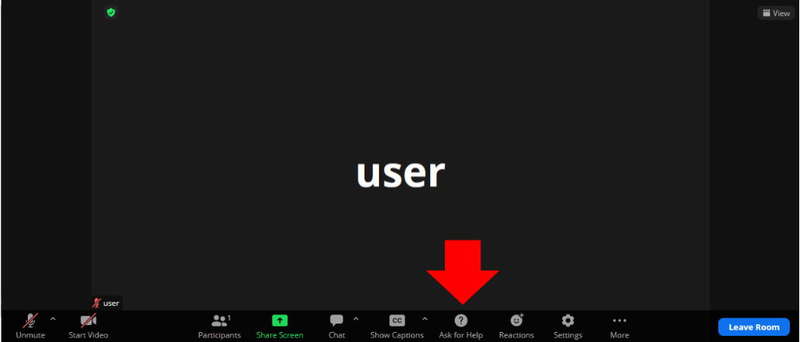

# Get started

## Introduction
In this lab you will go trhough the first steps to start the workshop.

### Objectives

In this lab, you will be guided through the following tasks:
* Download course material
* Verify the connection from your laptop to the your app-srv compute machine
* Test “ask for help”

### Prerequisites 

* You need a valid Oracle account on edelivery.oracle.com
* The software that you are using in this workshop is trial: you are eligible to use it for 30 days, after that you have to buy or remove it

## Task 1: Download material 
1. Download from provided link all materials in WORK_DIRECTORY
    The materials include:
    * Lectures slides in pdf
    * lab guide in pdf

## Task 2: Verify connection to the app-srv 

Connect with your SSH client using the public IP and the provided ssh key.

1. Example of connections from Linux, MAC, Windows Powershell
	```
    <span style="color:green">shell></span><copy> ssh -i id_rsa_app-srv opc@<public_ip></copy>
    ```

    > **Note:**   For linux and Mac terminals, make sure to asign the right permissions to your key, use:
        ```
        <span style="color:green">shell></span><copy>chmod 600 id_rsa_app-srv</copy>
        ```
      **Note:** In case you receive the Windows Powershell SSH error "Permissions for ... are too open" follow instruction at [this link](../addendum/addendum.md#task-troubleshooting-windows-powershell-ssh-error-on-permissions) to fix. 

      **Note:** Example of connections using PUTTY can be found in the [addendum 1](../addendum/addendum.md#task-putty-configuration) of this workshop.

## Task 3: Test "ask for help"
Zoom break-out rooms are isolated each other.
To ask trainers help, you must use the button “Ask for help” in the zoom interface, then confirm the request. Press it now and wait that the trainer join your session
    
    
    
The message “The Host has been invited” disappear after a short time.

## Acknowledgements
* **Author** - Marco Carlessi, Principal Sales Consultant
* **Contributors** -  Perside Foster, MySQL Solution Engineering, Selena Sánchez, MySQL Solutions Engineer
* **Last Updated By/Date** - Selena Sánchez, MySQL Solution Engineering, May 2023
